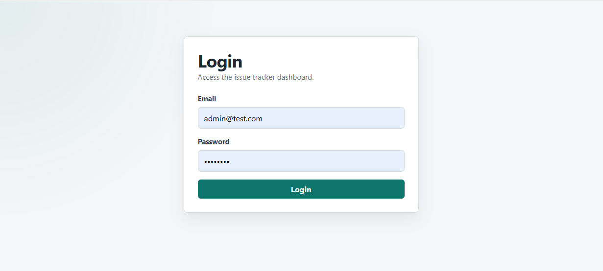
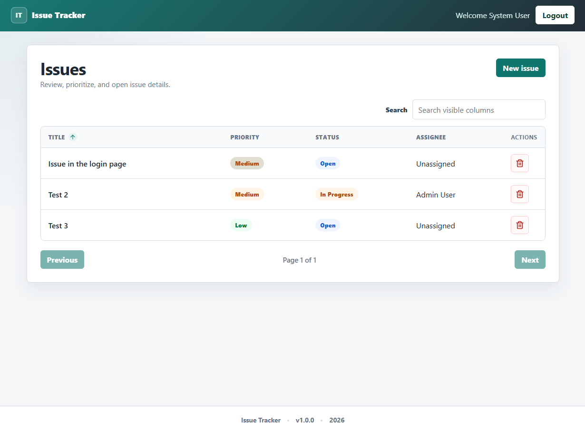
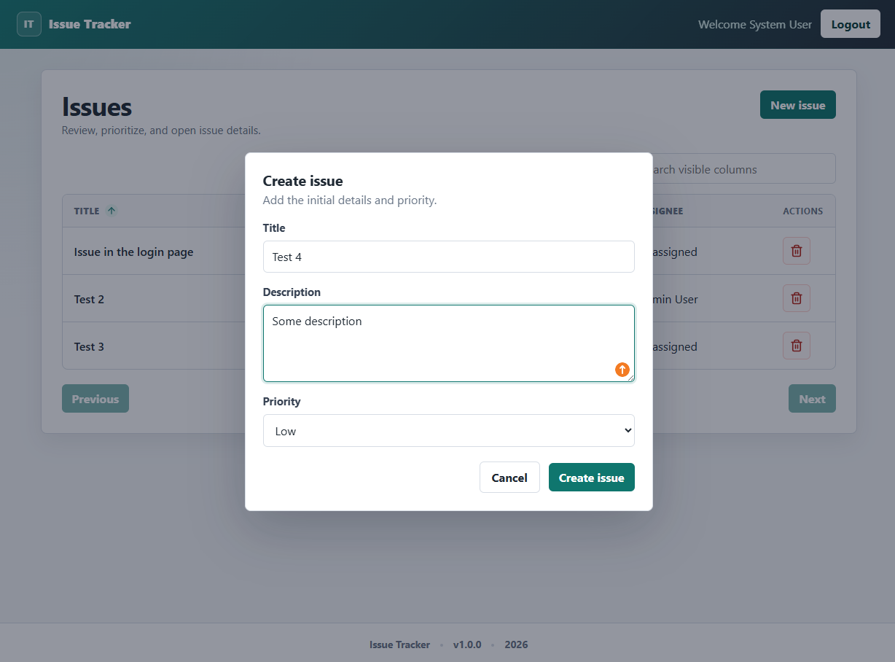
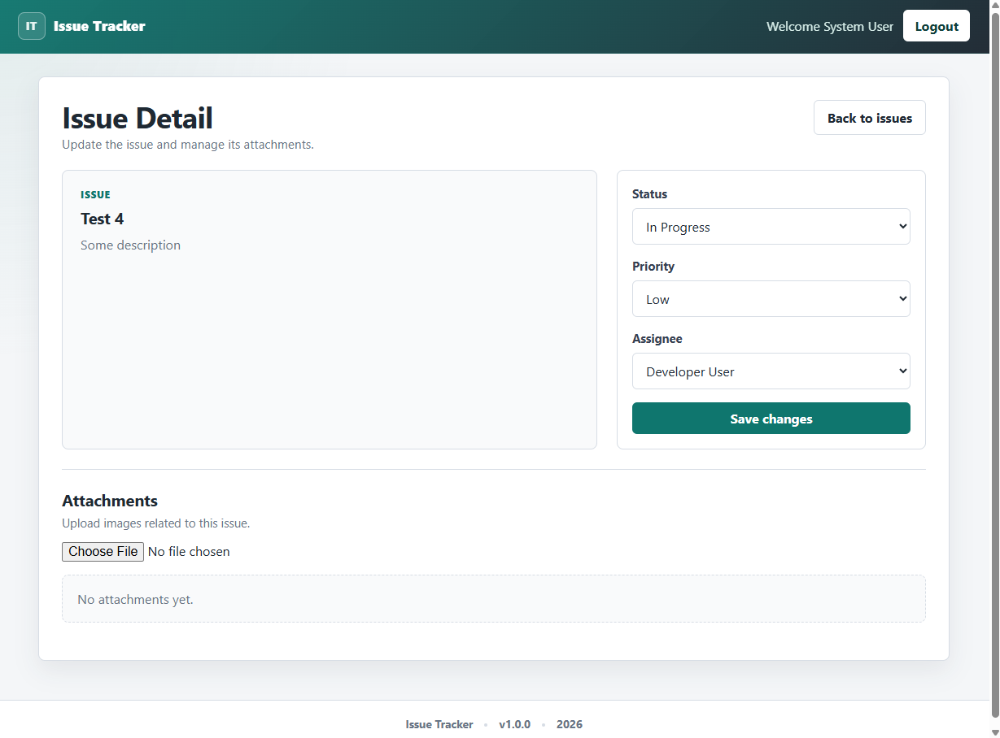
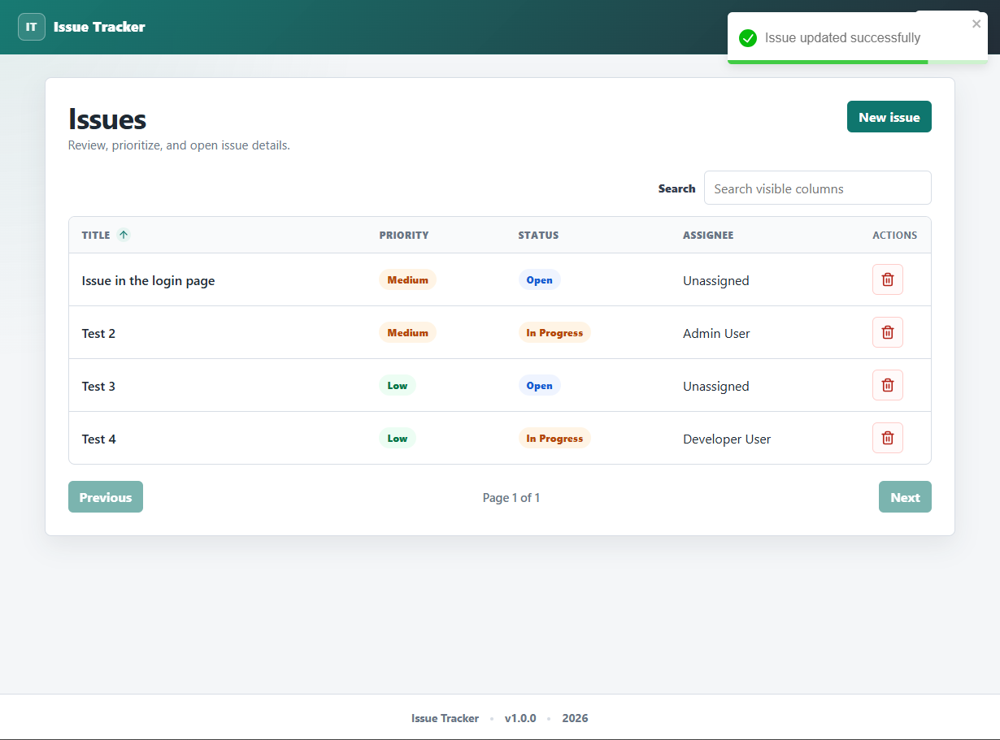
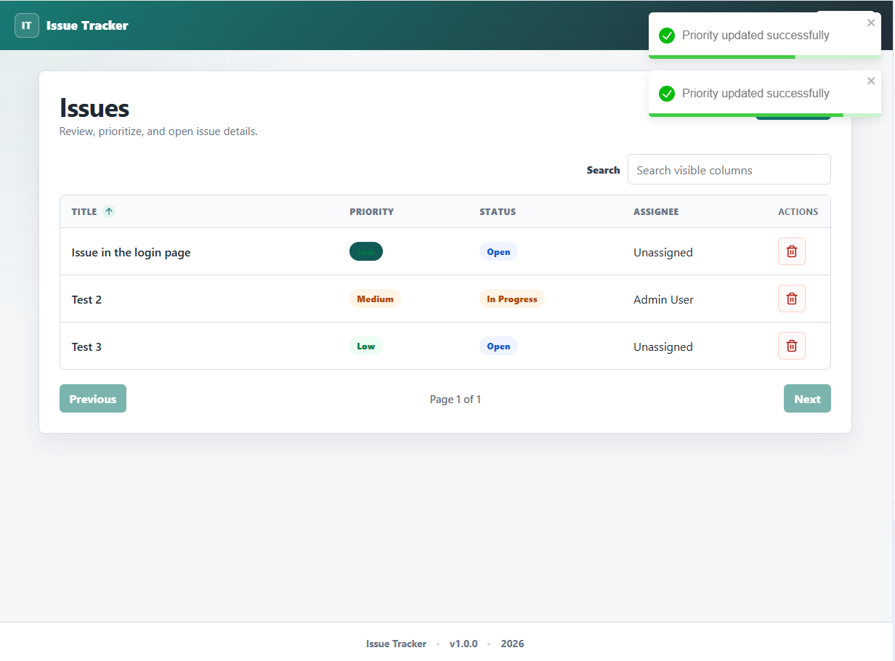
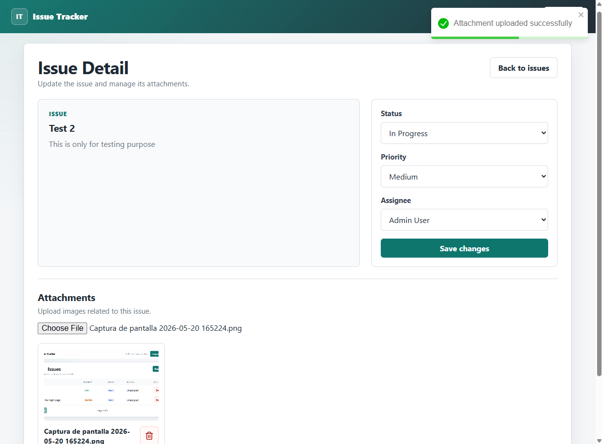
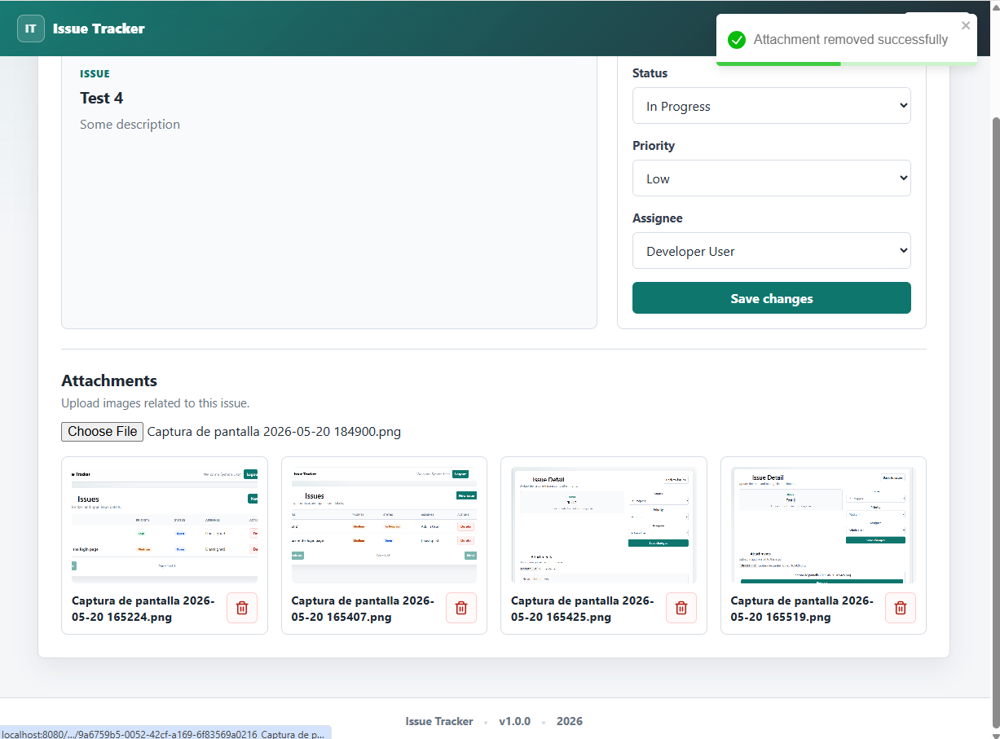
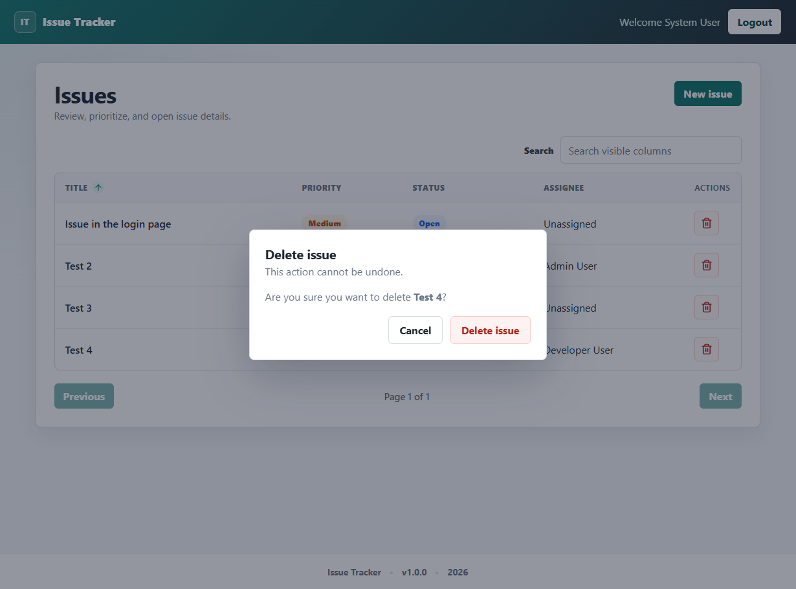
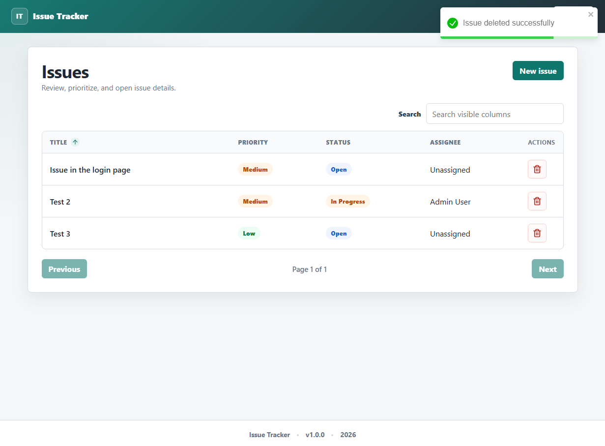

# Issue Tracker

Internal issue tracking app for creating, assigning, prioritizing, updating, and deleting issues with image attachments.

## Tech Stack

| Layer | Technologies |
| --- | --- |
| Backend | .NET 10 Web API, Entity Framework Core 10, PostgreSQL, AutoMapper, FluentValidation, JWT authentication |
| Architecture | Clean Architecture style: Api, Application, Domain, Infrastructure, Tests |
| Frontend | React 19, TypeScript, Vite, React Router, React Hook Form, Axios, React Toastify, Lucide React |
| Testing | xUnit, Moq, FluentAssertions, Vitest, Testing Library |
| Runtime | Docker, Docker Compose, nginx |
| Storage | PostgreSQL volume for data, local `/uploads/{issueId}` volume for attachments |

## Project Structure

```text
.
├── backend/
│   └── IssueTracker/
│       ├── IssueTracker.Api/
│       ├── IssueTracker.Application/
│       ├── IssueTracker.Domain/
│       ├── IssueTracker.Infrastructure/
│       └── IssueTracker.Tests/
├── frontend/
│   └── frontend/
│       ├── src/
│       ├── Dockerfile
│       └── nginx.conf
├── screenshots/
├── docker-compose.yml
├── .env.example
└── README.md
```

## Environment Files

Real `.env` files are intentionally ignored by git. Start from the examples:

```powershell
Copy-Item .env.example .env
Copy-Item frontend/frontend/.env.example frontend/frontend/.env
```

For Docker, the root `.env` is used by `docker-compose.yml`. For manual frontend development, `frontend/frontend/.env` should point to the API:

```env
VITE_API_URL=http://localhost:5000/api
```

Use a strong `JWT_KEY` in non-local environments. The values in `.env.example` are only for local development.

## Docker Setup

Requirements:

- Docker Desktop or Docker Engine with Compose

Run the full app:

```powershell
Copy-Item .env.example .env
docker compose up --build
```

URLs:

| Service | URL |
| --- | --- |
| Frontend | `http://localhost:8080` |
| API | `http://localhost:5000` |
| PostgreSQL | `localhost:5432` |

The API applies EF Core migrations at startup, so a clean machine should create the database schema automatically. Attachments are persisted through the mounted uploads volume:

```yaml
./backend/IssueTracker/IssueTracker.Api/uploads:/app/uploads
```

Default local login:

| Field | Value |
| --- | --- |
| Email | `admin@test.com` |
| Password | `admin123` |

## Manual Setup

Requirements:

- .NET 10 SDK
- Node.js 20+
- PostgreSQL 16+

1. Create PostgreSQL database:

```powershell
createdb IssueTrackerDb
```

2. Set backend environment variables or user secrets:

```powershell
$env:ConnectionStrings__DefaultConnection="Host=localhost;Port=5432;Database=IssueTrackerDb;Username=postgres;Password=postgres"
$env:Jwt__Key="replace_with_a_32_character_minimum_secret_key"
$env:Jwt__Issuer="IssueTracker"
$env:Jwt__Audience="IssueTrackerUsers"
$env:Jwt__ExpirationMinutes="60"
$env:TestUser__Email="admin@test.com"
$env:TestUser__Password="admin123"
$env:Frontend__Url="http://localhost:5173"
```

3. Run the API:

```powershell
dotnet run --project backend/IssueTracker/IssueTracker.Api/IssueTracker.Api.csproj
```

4. Run the frontend:

```powershell
Set-Location frontend/frontend
Copy-Item .env.example .env
npm install
npm run dev
```

Manual development URLs:

| Service | URL |
| --- | --- |
| Frontend | `http://localhost:5173` |
| API | `http://localhost:5000` |

## Tests

Backend:

```powershell
dotnet test backend/IssueTracker/IssueTracker.Backend.slnx
```

Frontend:

```powershell
Set-Location frontend/frontend
npm test
```

Build frontend:

```powershell
Set-Location frontend/frontend
npm run build
```

## API Documentation

All protected endpoints require a bearer token from `POST /api/auth/login`.

| Method | Endpoint | Auth | Description |
| --- | --- | --- | --- |
| `POST` | `/api/auth/login` | No | Returns JWT token for the configured test user |
| `GET` | `/api/issues?page=1&pageSize=10&status=Open` | Yes | Lists issues with pagination and optional status filter |
| `GET` | `/api/issues/{id}` | Yes | Gets one issue with assignee and attachments |
| `POST` | `/api/issues` | Yes | Creates an issue with `title`, `description`, `priority` |
| `PUT` | `/api/issues/{id}` | Yes | Updates `status`, `priority`, and `assigneeId` |
| `DELETE` | `/api/issues/{id}` | Yes | Deletes issue and its attachment files from disk |
| `POST` | `/api/issues/{issueId}/attachments` | Yes | Uploads one image file using multipart form data |
| `DELETE` | `/api/issues/{issueId}/attachments/{fileId}` | Yes | Deletes attachment record and physical file |
| `GET` | `/api/assignees` | Yes | Returns assignable users as `{ id, name }` |
| `GET` | `/uploads/{issueId}/{fileName}` | No | Serves uploaded files for previews |

Example create issue body:

```json
{
  "title": "Login button is not responding",
  "description": "Clicking the login button does not submit the form.",
  "priority": 2
}
```

Priority values:

| Name | Value |
| --- | --- |
| Low | `0` |
| Medium | `1` |
| High | `2` |

Status values:

| Name | Value |
| --- | --- |
| Open | `0` |
| In Progress | `1` |
| Closed | `2` |

## Frontend Features

- Login with JWT storage and Axios interceptor.
- Issues table with search, sortable columns, delete confirmation, and optimistic priority updates.
- Create issue modal with validation.
- Detail page for status, priority, and assignee edits.
- Image upload with progress and thumbnail previews.
- Attachment delete action that removes the file from disk through the API.
- Responsive layout with header, footer, cards, table-to-card mobile behavior, and toast feedback.

## Screenshots

### Login

Authentication screen for the configured test user.



### Issues List

Main issues table with search, sorting, priority badges, and delete actions.



### Create Issue

Modal form with title, description, and priority validation.



### Issue Detail

Detail view for updating status, priority, assignee, and managing attachments.



### Issue Detail Saved

Success feedback after saving issue detail changes.



### Priority Update

Optimistic priority update from the issues table.



### Attachment Added

Image attachment preview after upload.



### Attachment Removed

Attachment list after removing an uploaded file.



### Delete Confirmation

Confirmation modal before permanently deleting an issue.



### Issue Deleted

Issues list after deleting an issue.



## Repository Hygiene

The repository ignores:

- `.env` and environment-specific files
- `node_modules/`
- frontend `dist/`, Vite cache, coverage
- .NET `bin/`, `obj/`, test results
- runtime uploads
- generated screenshots, except `screenshots/.gitkeep`

Before committing, make sure local secrets are not staged:

```powershell
git status --short
```
